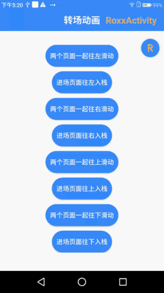
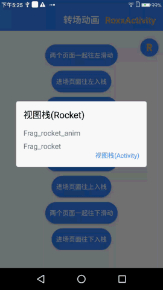
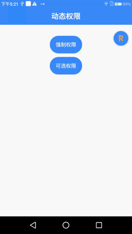
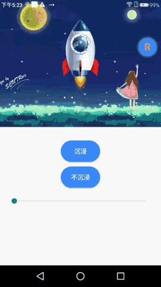
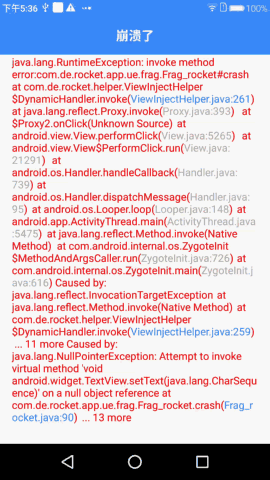

[](https://github.com/yinhaide/Rocket-master/wiki)
[](https://github.com/yinhaide/Rocket-master/wiki)
[](https://www.apache.org/licenses/LICENSE-2.0)

# Rocket
采用"单Activity+多Fragment"以及"多模块Activity+多Fragment"的设计模式编写的架构。一个非常轻量级又十分强大的Fragment管理框架。

|转场动画|路由栈视图|动态权限|
|:-----------:|:-----:|:---------:|
||||

|状态栏|崩溃处理|日志|
|:-----------:|:-----:|:---------:|
||||

## 特性
+ **无任何第三方依赖，纯原生编写，无需担心因为版本迭代导致的维护问题**

+ **采用线性路由栈，自行管理回退以及内存回收，提供悬浮球实时查看Fragment的栈视图，降低开发难度**

+ **页面切换以及页面通讯采用原生的commit以及setArguments，性能开销极小，页面切换流畅无卡顿**

+ **支持自定义Fragment转场动画**

+ **集成动态权限管理，包含必须权限（不允许不走生命周期）以及可选权限**

+ **集成状态栏管理，可适配状态栏各种场景，包括沉浸式风格**

+ **集成日志管理，记录崩溃日志、内部日志以及外部日志，可设置日志有效期，超时自动清理**

+ **提供更加人性化的崩溃捕获页面，精准定位根源bug文件以及行数，降低查bug难度**

+ **提供View注解，仅仅300行代码支持了各种View注入和事件绑定**

+ **提供百分比布局，支持PercentRelativeLayout、PercentLinearLayout和PercentFrameLayout**

## 分享设计Rockt架构的思路
**1、为什么要设计这个架构**
> Activity是一个非常重量级的设计！Activity的创建并不能由开发者自己控制，它是通过多进程远程调用并最终通过放射的方式创建的。在此期间，AMS需要做大量的工作，以至于Activity的启动过程极其缓慢。同时，Activity切换的开销也非常重量级，很容易造成卡顿，用户体验不好。另外，在宽屏设备上，如果需要多屏互动时，Activity的局限性也就表现了出来。为此Android团队在Android 3.0的时候引入了Fragment。Fragment的出现解决了上面两个问题。根据词海的翻译可以译为:碎片、片段，可以很好解决Activity间的切换不流畅。因为是轻量切换，性能更好，更加灵活。

**2、如何设计Fragment的路由栈**
> 一个好用的框架必然有一个好用的路由管理、堆栈管理的机制。Rocket的路由栈设计原则为:一个Activity对应一个线性的路由栈，所有的页面回退、内存回收以及Fragemnt生命周期管理都是内部完成，开发者只要专注跳转目标即可，并提供可视化的栈视图，极大简化开发难度。那么如何保证Fragment路由栈是线性的呢？只要能够做到所有的页面切换只有一个transfer的入口，路由栈的出栈入栈都在这里管理即可。

**3、如何处理页面切换、页面通信以及内存回收**
> Fragment页面跳转建议用commit在队列中提交，不建议用commitNowAllowingStateLoss等在线程中提交事务。一旦有快速切换页面逻辑，线程中提交事务很容易出现因为上个事务没消耗完毕导致崩溃。
> 页面通讯有很多方案，包括handle、广播、接口回调、Eventbus等等，都不是最优方案。Fragment提供的setArguments方法非常的轻量级，可以完美实现页面通讯。Rocket采用的就是原生的setArguments方案。
> 虽然Fragment相对Activity内存开销小了很多，但是如果大量Fragment创建没有及时回收的话会造成Activity内存臃肿。Rocket尽可能优的清理无用的Fragment，及时回收，消除应用卡顿。

**4、如何处理转场动画与的Fragment生命周期**
> 当Fragment中有setCustomAnimations转场动画的时候，做页面切换、页面通讯、内存管理等与生命周期相关的就多了很多的坑。Fragment提供的onCreateAnimation方法，不管有无动画都会走这个方法,并且提供完整的动画生命周期与动画详情。Rocket中充分利用这一点，
> 很好的规避了转场动画导致的各类难题。同时，Rocket提供设置转场动画入口给开发者，让开发者随心所欲定制自己的转场动画。

**5、如何实现沉浸式状态栏与正常状态栏的无缝切换**
> 状态栏有两种形态，显示以及隐藏。隐藏的时候整个页面向上顶满屏幕，带来很严重的突兀感。状态栏依附的是window窗体，在Rocket框架中，因为我们的页面单位是Fragment，也就是说只要一个页面切换状态栏都会导致整个窗体一起变化。
> Rocket提供一个方法，让用户自定义的标题栏可以向上或者向下偏移一个状态栏高度，在页面切换前后动态控制，避免突兀。对于沉浸风格的实现，Rocket在隐藏状态栏的情况下会动态创建一个浮在表面的新状态栏，用户可以控制颜色与透明度，达到沉浸效果。

**6、如何优雅处理动态权限申请与处理**
> 我们知道，Fragment一般依赖于Activity存活，并且生命周期跟Activity差不多，因此，我们进行权限申请的时候，可以利用透明的Fragment进行申请，在里面处理完之后，再进行相应的回调。
> 第一步：当我们申请权限申请的时候，先查找我们当前Activity是否存在代理fragment,不存在，进行添加，并使用代理Fragment进行申请权限
> 第二步：在代理 Fragment 的 onRequestPermissionsResult 方法进行相应的处理，判断是否授权成功
> 第三步：进行相应的回调。这些繁琐的步骤封装在空白的Fragment中，降低耦合，方便维护。

**7、如何更好的进行Fragment的事务提交**
> Fragment的事务提交主要涉及的函数有：commit()、commitNow()、commitAllowingStateLoss()、commitNowAllowingStateLoss()以及executePendingTransactions()。下面进行比较：
> 1、使用commit()的时候, 一旦调用, 这个commit并不是立即执行的, 它会被发送到主线程的任务队列当中去, 当主线程准备好执行它的时候执行。但是有时候你希望你的操作是立即执行的, 之前的开发者会在commit()调用之后加上 executePendingTransactions()来保证立即执行, 即变异步为同步。
> 2、support library从v24.0.0开始提供了 commitNow()方法, 之前用executePendingTransactions()会将所有pending在队列中还有你新提交的transactions都执行了, 而commitNow()将只会执行你当前要提交的transaction. 所以commitNow()避免你会不小心执行了那些你可能并不想执行的transactions。
> 3、如果你调用的是commitAllowingStateLoss()与commitNowAllowingStateLoss()，并且是在onSaveInstanceState()之后, 就不会抛出IllegalStateException，允许你丢失状态，通常你不应该使用这个函数。
> 在Rocket的架构中，路由栈是串行的，主张采用commit()提交事务，保证每条事务在队列中依次执行，不争不抢，有条不紊。

## 如何快速集成

### 导入方式

```
api 'com.github.yinhaide:Rocket-master:0.0.2'
```

### 工程配置

**1、继承RoApplication**
```java
public class SampleApplication extends RoApplication {

    @Override
    public void onCreate() {
        super.onCreate();
    }
}
```

**2、创建Frag_rocket并且继承RoFragment**
```java
public class Frag_rocket extends RoFragment {

    @Override
    public int onInflateLayout() {
        return R.layout.frag_rocket;
    }

    @Override
    public void initViewFinish(View inflateView) {
        //页面初始化完毕会回调
    }

    @Override
    public void onNexts(Object object) {
        //initViewFinish之后的业务逻辑回调，包括传递页面通讯信息object
    }
}
```

**3、创建RoxxActivity并且继承RoActivity**
+ RoxxActivity.class
```java
public class RoxxActivity extends RoActivity {

    //注册Rofrgment
    private Class[] roFragments = {
            Frag_rocket.class,
    };

    @Override
    public ActivityParamBean initProperty() {
        //配置全局的信息
        ActivityParamBean actParam = new ActivityParamBean();
        actParam.setLayoutId(R.layout.activity_main);//Activity布局
        actParam.setFragmentContainId(R.id.fl_fragment_contaner);//Fragment容器
        actParam.setSaveInstanceState(true);//页面重载是否要恢复之前的页面
        actParam.setToastCustom(true);//用自定义的吐司风格
        actParam.setRoFragments(roFragments);//需要注册Fragment列表
        actParam.setShowViewBall(true);//是否显示悬浮球
        actParam.setRecordBean(new RecordBean(true,true,true,7));//日志配置
        actParam.setEnableCrashWindow(true);//是否隐藏框架自定义的崩溃的窗口
        actParam.setStatusBar(new StatusBarBean(true, Color.argb(0, 0, 0, 0)));//状态栏
        return actParam;
    }

    @Override
    public void initViewFinish() {
        //页面初始化完毕会回调
    }

    @Override
    public void onNexts(Object object) {
        //initViewFinish之后的业务逻辑回调，包括传递页面通讯信息object
    }

    @Override
    public boolean onBackClick() {
        //管理回退逻辑
        return false;
    }
}
```
+ activity_main.xml
```xml
<?xml version="1.0" encoding="utf-8"?>
<com.de.rocket.ue.layout.PercentRelativeLayout xmlns:android="http://schemas.android.com/apk/res/android"
    xmlns:tools="http://schemas.android.com/tools"
    android:layout_width="match_parent"
    android:layout_height="match_parent"
    android:background="@color/colorAccent"
    tools:context=".ue.activity.MainActivity">

    <FrameLayout
        android:id="@+id/fl_fragment_contaner"
        android:background="@color/colorPrimaryDark"
        android:layout_width="match_parent"
        android:layout_height="match_parent"/>

</com.de.rocket.ue.layout.PercentRelativeLayout>
```
## 详细使用说明
**1、Activity-ActivityParamBean参数**
```java
public class ActivityParamBean{
    //必需，Activity布局的Layout ID
    private int layoutId;
    //必需，Activity布局的Layout装Fragment的容器id
    private int fragmentContainId;
    //必需，支持的Fragment列表
    private Class[] roFragments;
    //Activity恢复是是否从保存的状态中恢复，false的话整个页面重新创建显示第一个Fragment
    private boolean isSaveInstanceState;
    //是否用传统自定义的吐司风格，false表示用系统的吐司，系统风格在通知关闭情况也是禁用的
    private boolean isToastCustom;
    //是否显示线性栈视图悬浮球
    private boolean showViewBall;
    //是否显示框架自定义的崩溃的窗口
    private boolean enableCrashWindow;
    //日志配置(mnt/sdcard/Android/data/<package name>/files/rocket/<date>/xx.log)
    private RecordBean recordBean;
    //状态栏的属性(沉浸式风格以及颜色配置)
    private StatusBarBean statusBar;
}
```
**2、Fragment-页面切换**
```java
//注意：下面只提供带全部参数的方法，Rocket提供阶梯式参数的函数
public class Rofragment{
    /**
     * 带详细参数跳转到新的Fragment
     * @param targetClass 目标Fragment
     * @param isOriginalRemove 是否要回收内存
     * @param isTargetReload 是否要刷新目标Fragment
     * @param object 跳转携带的参数
     * @param clearTop 清掉目标Fragment在栈位置顶端所有的Fragment
     * @param animationBean 转场动画
     */
    public void toFrag(@NonNull Class targetClass, boolean isOriginalRemove, boolean isTargetReload, Object object, boolean clearTop, AnimationBean animationBean);

    /**
     * 带详细参数返回（默认无需主动调用，系统自行返回，除非需要自定义返回，需要重写onBackPresss）
     * @param isTargetReload 刷新目标页面
     * @param object 传递对象
     * @param animationBean 转场动画
     */
    public void back(boolean isTargetReload, Object object,AnimationBean animationBean);

    /**
     * 从Fragment中显示跳转到Activity
     * @param activityClass 对应的Activity
     * @param targetFragTag 对应的Fragment的SimpleName
     * @param object 携带的数据
     */
    public void toAct(Class activityClass,String targetFragTag,Object object);

    /**
     * 从Fragment中隐式跳转到Activity
     * @param action 对应的Activity的Action
     * @param targetFragTag 对应的Fragment的SimpleName
     * @param object 携带的数据
     */
    public void toAct(String action,String targetFragTag,Object object);
}
```
**3、Fragment-吐司**
```java
public class Rofragment{ 
    
    /**
     * 吐司
     * @param tip 吐司内容
     */
    public void toast(String tip);
}
```

**4、Fragment-权限申请**
```java
public class Rofragment{ 
    
    /**
     * 主动请求权限，关注每个权限的允许与拒绝情况
     * 注意：权限必须要在AndroidManifest.xml注册才能正常使用
     * @param permissions 权限列表
     * @param permissionListener 回调函数
     * @return 是否已经在AndroidManifest中注册
     */
    public boolean needPermissison(String[] permissions, PermissionListener permissionListener);
    
    /**
     * 重写权限申请方法，页面进来必须要先要求权限
     * 必须所有权限都通过才会执行生命周期
     * 如果权限没有全部允许,还想执行生命周期的话，需要在子类调用:super.initPermission(rootView);
     */
    @Override
    public String[] initPermission();
}
```
**5、Fragment-APP内部语言国际化**
```java
public class Rofragment{ 
    
    /**
     * 读取APP需要缓存的语言
     *
     * @return locale 当前设置的语言
     */
    public Locale getSaveLocale();
    
    /**
     * 设置APP需要缓存的语言
     *
     * @param locale 需要设置的语言
     */
    public void setSaveLocale(Locale locale);
}
```

**6、Fragment-状态栏切换**
```java
public class Rofragment{ 
    
    /**
     * 设置状态栏颜色
     *
     * @param color         状态栏颜色值
     * @param isImmersion   是否是沉浸式风格，隐藏状态栏创建自定义状态栏
     */
    public void setStatusBarColor(@ColorInt int color,boolean isImmersion);
    
    /**
     * 使指定的View向下Padding偏移一个状态栏高度，留出状态栏空间，主要用于设置沉浸式后,页面顶到顶端有突兀感
     *
     * @param targetView        需要偏移的View
     * @param enable            开启或者关闭
     * @param isPaddingOrMargin 向下偏移是padding还是margin，true的话是padding，false的话是margin
     */
    public void setOffsetStatusBar(View targetView, boolean enable, boolean isPaddingOrMargin);
}
```
**7、Fragment-子类可以重写的方法**
```java
public class Rofragment{ 
    
    /**
     * 是否由内部处理返回事件,默认false,由用户处理
     *
     * @return backAuto
     */
    protected boolean onBackPresss();
    
    /**
     * 从后台进入前台是否要刷新数据,默认false
     *
     * @return isReloadData
     */
    protected boolean isReloadData();
    
    /**
     * Fragment转场动画结束的回调
     *
     * @param  animation 转场动画
     */
    public void onFragAnimationEnd(Animation animation);
}
```
**8、Fragment-View注解**
```java
public class xxfragment{ 
    
    /**
     * 变量注解
     **/
    @BindView(R.id.tv_right)
    private TextView tvRight;
    
    /**
     * 事件注解
     * 1. 方法必须私有限定,
     * 2. 方法参数形式必须和type对应的Listener接口一致.
     * 3. 注解参数value支持数组: value={id1, id2, id3}
     **/
    @Event(value = R.id.tv_right, type = View.OnClickListener.class/*可选参数, 默认是View.OnClickListener.class*/)
    private void toRoxx(View view);
    
    /**
     * 绑定ViewHolder(在Adapter中的事例)
     **/
    private void bindViewHolder(){
        
        /**
         * 绑定ViewHolder,之后可以注解的方式获取绑定viewy以及事件注解.用法如下：
         * ViewHolder(View itemView) {
         *   super(itemView);
         *   Rocket.bindViewHolder(this,itemView);//View注解
         * }
         * @param viewHolder viewHolder
         * @param view itemView
         */
        Rocket.bindViewHolder(viewHolder,view);
    }
}
```

**9、Layout-百分比布局**
+ 支持的百分比布局
> PercentRelativeLayout、PercentLinearLayout和PercentFrameLayout
+ 支持的百分比参数
```xml
<declare-styleable name="PercentLayout_Layout">
    <attr format="string" name="layout_widthPercent"/>
    <attr format="string" name="layout_heightPercent"/>
    <attr format="string" name="layout_marginPercent"/>
    <attr format="string" name="layout_marginLeftPercent"/>
    <attr format="string" name="layout_marginTopPercent"/>
    <attr format="string" name="layout_marginRightPercent"/>
    <attr format="string" name="layout_marginBottomPercent"/>
    <attr format="string" name="layout_marginStartPercent"/>
    <attr format="string" name="layout_marginEndPercent"/>
    <attr format="string" name="layout_textSizePercent"/>
    <attr format="string" name="layout_maxWidthPercent"/>
    <attr format="string" name="layout_maxHeightPercent"/>
    <attr format="string" name="layout_minWidthPercent"/>
    <attr format="string" name="layout_minHeightPercent"/>
    <attr format="string" name="layout_paddingPercent"/>
    <attr format="string" name="layout_paddingTopPercent"/>
    <attr format="string" name="layout_paddingBottomPercent"/>
    <attr format="string" name="layout_paddingLeftPercent"/>
    <attr format="string" name="layout_paddingRightPercent"/>
</declare-styleable>
```
**10、Rocket-工具类**
> 说明:本类作用是暴露内部接口供外部使用，大量的内部方法将放在这里
```java
public class Rocket{
    
    /**
     * 外部写入Log信息
     *
     * @param logString Log信息
     */
    public static writeOuterLog(String logString);
}
```

## 四、踩坑经验之旅
### 1、Can not perform this action after onSaveInstanceState
> onSaveInstanceState方法是在该Activity即将被销毁前调用，来保存Activity数据的，如果在保存完毕状态后 再给它添加或者隐藏Fragment就会出错。

**解决方案**
* 方案一：把commit()方法替换成 commitAllowingStateLoss()，不采用。
* 方案二：在Activity 回收时 onSaveInstanceState 中不缓存Fragment ,在OnCreate 中移除缓存相应Fragment数据，采用。
```java
public abstract class RoActivity extends FragmentActivity {
    
    private static final String BUNDLE_SURPOTR_FRAGMENTS_KEY = "android:support:fragments";
    private static final String BUNDLE_FRAGMENTS_KEY = "android:fragments";
    
    @Override
    protected void onSaveInstanceState(Bundle outState) {
        super.onSaveInstanceState(outState);
            if (outState != null) {
                //重建时清除系统缓存的fragment的状态
                outState.remove(BUNDLE_SURPOTR_FRAGMENTS_KEY);
                outState.remove(BUNDLE_FRAGMENTS_KEY);
            }
    }
    
    @Override
    protected void onCreate(Bundle savedInstanceState) {
        if (savedInstanceState != null) {
            //重建时清除系统缓存的fragment的状态
            savedInstanceState.remove(BUNDLE_FRAGMENTS_KEY);
            savedInstanceState.remove(BUNDLE_SURPOTR_FRAGMENTS_KEY);
        }
        super.onCreate(savedInstanceState);
    } 
}
```

### 2、FragmentManager is already executing transactions
> 这个问题是由于在执行Fragment事务提交的时候，commitNow以及commitNowAllowingStateLoss表示立刻执行事务提交，这个时候Activity 中的 FragmentManager 的第一次任务还没有执行完毕，其他的操作又导致它需要进行第二次任务，所以发生错误。
```java
public class Fragment {
    private void ensureExecReady(boolean allowStateLoss) {
        if (mExecutingActions) {
            // 这正是堆栈日志中抛出的异常信息
            throw new IllegalStateException("FragmentManager is already executing transactions");
        }
    }
}
```
**解决方案**
* 等待第一个任务执行完毕后再执行第二个任务
```java
public class xxFragment extends RoFragment {
    private void doInHandler(){
        new Handler().post(() -> {
        //事务的提交            
        });
    }
}
```
* 采用commit()在队列中提交事务
```
//commit能保证在消息队列中提交事务，保证上个事务处理完毕才会执行
fragmentTransaction.commit()；
```
### 3、Fragment  xxx not attached to a context.
> 当一个Fragment已经从Activity中remove掉的时候，执行getString()、getResources()等，就会抛出这个异常。这种情况经常出现在异步回调的场景，比如一个网络请求比较耗时，在返回之前fragment已经销毁，当尝试读取资源就会出现。
```java
public class xxFragment extends RoFragment {
    public void test() {
        //异步获取数据，并提示
        new Thread(() -> {
            try {
                Thread.sleep(5000);
                toast(getString(R.string.app_name));
            } catch (InterruptedException e) {
                e.printStackTrace();
            }
        }).start();
        //返回上个页面并且销毁
        back();
    }
}
```
**解决方案**
* 方案一：直接使用Activity的getString()与getResources()获取资源。
* 方案二：利用Fragment的isAdd()判断是否被移除在获取资源。
```java
public abstract class RoFragment extends Fragment {
    public Resources getRoResources() {
        if(isAdded()){
            return requireContext().getResources();
        }else{
            return activity.getResources();
        }
    }
}
```
### 4、fragmentTransaction.add(fragment).commit() 没有立即生效
> 上文已经提到过，commit()会在队列中依次提交事务。当你提交成功并且利用fm.findFragmentByTag(targetTag)去寻找它的时候发现并不存在。但是他确实已经在队列中排队提交了。当你尝试延时几十毫秒去读的时候发现有了。
> 这会导致一个逻辑问题，比如你做页面切换的时候，当两次切换的时差小于单个事务提交，就会导致一个Activity中存在多个相同tag的Fragment，这不是我们想要看到的。
```java
//当快速执行两次页面跳转，理论上应该只会添加一个，但实际上两个都会被添加
public abstract class RoFragment extends Fragment {
    
    private void testTofrg(){//测试跳转
        toFrag(Frag_rocket_permission.class);
        toFrag(Frag_rocket_permission.class);
    }

    public void toFrag(Class targetClass) {
        FragmentManager fm = activity.getSupportFragmentManager();
        FragmentTransaction ft = fm.beginTransaction();
        String targetTag = targetClass.getSimpleName();
        RoFragment targetFragment = (RoFragment) fm.findFragmentByTag(targetTag);//找出目标Fragment
        if (targetFragment == null) {//目标不存在才会添加,保证单一性
            targetFragment = (RoFragment) targetClass.newInstance();
            ft.add(containid, targetFragment, targetTag);//添加
        }
        ft.commit();
    }
}
```
**解决方案**
* 上个页面跳转的时候加锁，直到页面跳转结束才释放锁，允许下个跳转，过快的跳转丢弃
```java
public abstract class RoFragment extends Fragment {
    private void toFrag(){
        if(!toFragEnable){//太快跳转锁住丢弃
        return;
        }
        boolean result = toFragIner();
        //跳转成功先锁住
        if(result){
            toFragEnable = false;
        }
    }
}
```
```java
public abstract class RoFragment extends Fragment { 
    @Override
    public Animation onCreateAnimation(int transit, boolean enter, int nextAnim) {
        //Fragment show and hide 都会执行这个回调，用来处理页面跳转逻辑
        //成功跳转才开锁，允许下次跳转
        toFragEnable = true;
    }  
}
```
### 5、请不要在Fragment转场动画没结束之前允许用户操作
> 你的Fragment转场动画还没结束时，如果执行了其他事务等方法，可能会导致栈内顺序错乱，同时会增加页面状态的复杂度与不可控性。

**解决方案**
* 动画结束再执行事务(加锁)，或者临时将该Fragment设为无动画
```java
public abstract class RoFragment extends Fragment {
    @Override
    public Animation onCreateAnimation(int transit, boolean enter, int nextAnim) {
        if(nextAnim > 0){//有转场动画的情况
            Animation anim = AnimationUtils.loadAnimation(getActivity(), nextAnim);
            anim.setAnimationListener(new Animation.AnimationListener() {
                public void onAnimationStart(Animation animation) {
                    isAnimationEnd = false;//动画开始
                }
                public void onAnimationRepeat(Animation animation) {}
                public void onAnimationEnd(Animation animation) {
                    isAnimationEnd = true;//动画结束了
                }
            });
            return anim;
        }
        return null;
    }   
}
```
### 6、getActivity() = null导致Crash
> 可能你遇到过getActivity() = null，或者平时运行完好的代码，在“内存重启”之后，调用getActivity()的地方却返回null，报了空指针异常。大多数情况下的原因：你在调用了getActivity()时，当前的Fragment已经onDetach()了宿主Activity。

**解决方案**
* 在onAttach(Activity activity)里将Activity全局保存下来
```java
public abstract class RoActivity extends FragmentActivity {
    //缓存activity
    public RoActivity activity;
    
    @Override
    public void onAttach(Context context) {
        super.onAttach(context);
        this.activity = (RoActivity) context;
    }
}
```
## 这个项目会持续更新中... 
> 都看到这里了，如果觉得写的可以或者对你有帮助的话，给个星星点下Star呗~

## LICENSE
````
Copyright 2019 haide.yin(123302687@qq.com)

Licensed under the Apache License, Version 2.0 (the "License");
you may not use this file except in compliance with the License.
You may obtain a copy of the License at

    http://www.apache.org/licenses/LICENSE-2.0

Unless required by applicable law or agreed to in writing, software
distributed under the License is distributed on an "AS IS" BASIS,
WITHOUT WARRANTIES OR CONDITIONS OF ANY KIND, either express or implied.
See the License for the specific language governing permissions and
limitations under the License.
````