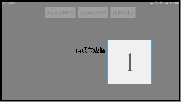

[](https://github.com/yinhaide/Rocket-master/wiki)
[](https://github.com/yinhaide/Rocket-master/wiki)
[](https://www.apache.org/licenses/LICENSE-2.0)

# HDMediaPlayer
> 该类包依托于谷歌Mediaplayer二次封装，一行代码就可以实现播放的逻辑。 <br/>
> 谷歌中国API链接: [Google官网API](https://developer.android.google.cn/guide/topics/media/mediaplayer.html) <br/>



## 特性
+ **该类支持播放格式有：音乐（.mp3、.wav、.ogg）、视频(.mp4、.3gp)**

+ **支持播放本地音频、视频**

+ **支持播放Assets目录下的音频、视频**

+ **支持播放网络网络流媒体(仅限上述格式)**

## 如何快速集成

### 导入方式
在工程级别的**build.gradle**添加
```
allprojects {
    repositories {
        ...
        maven { url 'https://jitpack.io' }
    }
}
```
在应用级别的**build.gradle**添加
```
api 'com.github.yinhaide:HDMediaPlayer:0.0.1'
```

### 如何使用

* 一行代码实现播放Assets目录下的mp4:

```
MediaPlayerHelper.getInstance().setSurfaceView(surfaceView).playAsset(context,"test.mp4");
```


* 一行代码实现播放Assets目录下的mp3:

```
MediaPlayerHelper.getInstance().playAsset(context,"test.mp3");
```

* 一行代码实现播放网络流媒体或者本地全路径流媒体:

```
/**
 * urlString 可为网络流媒体连接，也可以为本地存储全路径链接
 */
MediaPlayerHelper.getInstance().setSurfaceView(surfaceView).play(urlString);
```

* 如果想得到详细的回调信息：

```
MediaPlayerHelper.getInstance().setMediaPlayerHelperCallBack(new MediaPlayerHelper.MediaPlayerHelperCallBack() {
    @Override
    public void onCallBack(MediaPlayerHelper.CallBackState state, MediaPlayerHelper mediaPlayerHelper, Object... args) {
        Log.v(TAG,"--"+state.toString());
        if(state== MediaPlayerHelper.CallBackState.PROGRESS){
            int percent=(int)args[0];
            Log.v(TAG,"--progress:"+percent);
        }
    }
});
```

* 更多的用法请查看demo:

```
/** 设置播放进度回调时间间隔 */
MediaPlayerHelper.getInstance().setProgressInterval(msec);
/** 获得MediaPlayer对象，进行更多的自定义的操作 */
MediaPlayerHelper.getInstance().getMediaPlayer().pause();
MediaPlayerHelper.getInstance().getMediaPlayer().start();
MediaPlayerHelper.getInstance().getMediaPlayer().stop();
```


## 这个项目会持续更新中... 
> 都看到这里了，如果觉得写的可以或者对你有帮助的话，顺手给个星星点下Star~

这个控件内部采用一个Fragment框架，如果有兴趣的话可以去了解一下
+ [https://github.com/yinhaide/Rocket-master](https://github.com/yinhaide/Rocket-master)

## 关于我
+ **Email:** [123302687@qq.com](123302687@qq.com)
+ **Github:** [https://github.com/yinhaide](https://github.com/yinhaide)
+ **简书:** [https://www.jianshu.com/u/33c3dd2ceaa3](https://www.jianshu.com/u/33c3dd2ceaa3)
+ **CSDN:** [https://blog.csdn.net/yinhaide](https://blog.csdn.net/yinhaide)

## LICENSE
````
Copyright 2019 haide.yin(123302687@qq.com)

Licensed under the Apache License, Version 2.0 (the "License");
you may not use this file except in compliance with the License.
You may obtain a copy of the License at

    http://www.apache.org/licenses/LICENSE-2.0

Unless required by applicable law or agreed to in writing, software
distributed under the License is distributed on an "AS IS" BASIS,
WITHOUT WARRANTIES OR CONDITIONS OF ANY KIND, either express or implied.
See the License for the specific language governing permissions and
limitations under the License.
````